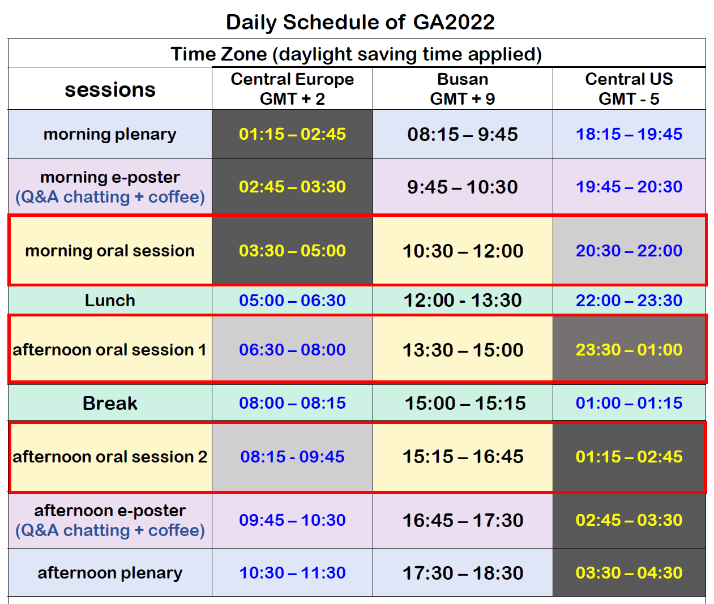

# FM8
"Focus Meeting 8" at the 31st IAU General Assembly (2022, Busan, S. Korea). The title is **Planetary Astronomy via Telescopic and Microscopic Approaches**.

This is a small website to host information by FM8 LOCs **at one single place**. 

## Instructions (Guidelines)
* **Chairs & Co-chairs**: >>[link](instructions_to_chairs.md)<<
* **In-room Speakers**: >>[link](instructions_to_inroom.md)<<
* **Remote Speakers**: >>[link](instructions_to_remote.md)<<
* **e-Posters**: >>[link](instructions_to_eposter.md)<<

##  Zoom links
Sent to FM8 _remote speakers_ and _chairs_ via email. 
> Please check your email box (or spam folder, just in case)
> * Email title: "[IAU FM8] Zoom link for remote oral speaker"
> * Email time: 2022-07-30T12:17 KST (03:17 UTC) 
> * Eamil from: One of the SOC members (``Masateru ISHIGURO <ishigrmt@gmail.com>``)

## Schedules
* **e-Poster schedules**: >>[link](https://docs.google.com/spreadsheets/d/19wTkitOYZKLuY27WhNHv6kSKkr_jcNtPZO_r6xfRgCA/edit?usp=sharing)<<
* General time schedule: 

## Official Docs from IAUGA
(click the filenames)
* Which room should I go?: [``GA2022_RoomAllocation.pdf``](iauga_docs/GA2022_RoomAllocation.pdf)
    - **FM8: Conv. Hall 106** 
    - **Preview Room: Conv. Hall 204**
* COVID, Restaurants: [``General_Information(20220727).pdf``](iauga_docs/General_Information(20220727).pdf)

## Contacts
Below are the IAUGA 2022 FM8 LOC members. 

    e-mail: iau2022.fm8.loc@gmail.com
    
    MOON    , Hong-Kyu (KASI)
    ISHIGURO, Masateru (SNU) 
    LEE     , Hee-Jae  (KASI)
    GEEM    , Jooyeon  (SNU) 
    BACH    , Yoonsoo  (SNU) 

